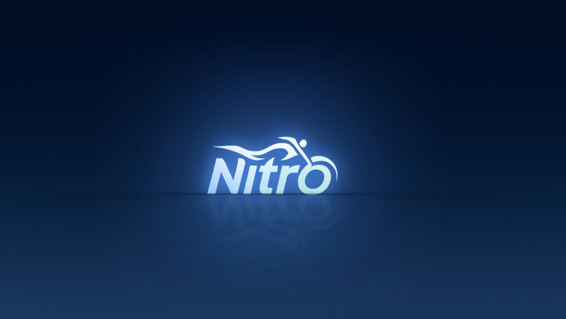

  

<h1 align="center">Seja bem-vindo(a) ao Github do Projeto Nitro </h1>

A Nitro busca resolver questões de segurança, apoio e praticidade para motociclistas tanto na estrada quanto no cotidiano. O aplicativo oferece suporte em situações de emergência, facilita o acesso a serviços mecânicos e promove a conexão entre motociclistas.

---

## 🎯 Missão

Oferecer segurança, praticidade e apoio ao motociclista em qualquer rota, conectando pessoas, lugares e serviços confiáveis para que cada viagem seja mais tranquila e bem vivida.

## 👀 Visão

Ser o principal ponto de apoio digital para motociclistas no Brasil, reconhecido por facilitar a vida na estrada, promover a comunidade e garantir segurança em qualquer trajeto.

## 🛡️ Valores

  
- Segurança em Primeiro Lugar

- Conexão com a Comunidade

- Confiança e Transparência

- Praticidade com Tecnologia

- Respeito à Liberdade do Motociclista

---
## 🫂 Equipe

  <!-- Repetir este bloco para cada membro da equipe -->
  <a href="<!-- URL do LinkedIn do membro -->" target="_blank">
    " alt='Nome do Membro' width="180px">
  </a>

---

## 📬 Contato

---

## 📌 Informações adicionais (adicionar futuramente)

- 🔨 Tecnologias utilizadas: `Ex: Flutter, Firebase, Node.js, etc.`
- 🚀 Status do projeto: `Ex: Em desenvolvimento, MVP entregue, etc.`
- 📄 Documentações técnicas: `Ex: Wireframes, protótipos, APIs, etc.`
- 🗂️ Organização dos repositórios: `Ex: Monorepo, multi-repo`
- 🛠️ Contribuindo com o projeto: `Instruções para contribuir`
- 📚 Links úteis: `Guia de instalação, setup, etc.`

---
